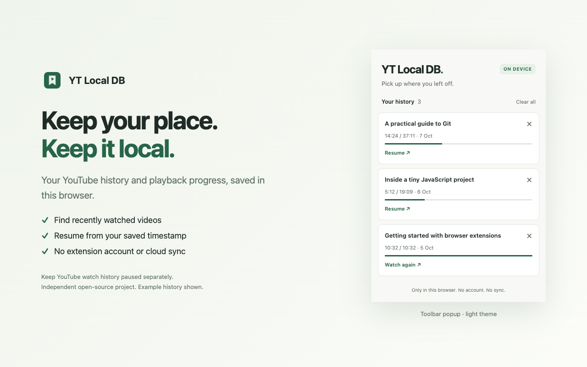

# YT Local DB

**Pick up where you left off. Keep your history local.**

A tiny, open-source Chrome extension that remembers YouTube videos and playback progress in your browser. Keep YouTube's watch history paused; use the extension popup to continue watching instead.

Repository name: `yt-local-db`. No database library, framework, runtime dependencies, account, or server.



## What it does

- Saves the video title, playback position, duration, and last-watched date.
- Shows your history, most recent first, with a progress bar.
- Opens a saved video at its last position. Finished videos open from the start.
- Lets you delete a video or clear all local history.
- Supports light and dark browser themes.

Progress saves at most every five seconds during playback, and also on pause, seek, completion, hiding the tab, and navigation away. Abruptly closing the browser can lose the last few seconds.

## Install locally

1. [Download the latest extension ZIP](https://github.com/shettyh/yt-local-db/releases/latest) and unzip it, or clone this repository.
2. Open `chrome://extensions` in desktop Chrome.
3. Enable **Developer mode**.
4. Click **Load unpacked** and select the unzipped extension folder (or cloned `yt-local-db` folder) containing `manifest.json`.
5. Pin **YT Local DB** to the toolbar and reload any already-open YouTube tabs.
6. Keep YouTube watch history **paused** in your Google account settings. The extension does not change that setting.

Watch a regular video at `www.youtube.com/watch`, then open the extension popup to resume it later. Resume opens a new tab using YouTube's timestamp URL. Opening a video elsewhere does **not** automatically seek to the saved position.

No build step or `npm install` is needed.

## Chrome Web Store

Submitted to the Chrome Web Store and awaiting review. The store link will be added once approved.

## Boundaries

- Desktop Chrome only. No native mobile-app tracking or cross-device sync.
- Regular watch-page videos only; not Shorts, embeds, or live streams with unbounded duration.
- Ads are skipped when YouTube marks the player as showing an ad.
- Incognito tracking is disabled.
- This does not hide recommendations or make YouTube browsing anonymous.
- Deleting an actively playing video does not stop recording; further playback can add it again.
- If the same video is playing in multiple tabs, the latest save wins.
- Storage is limited by Chrome's standard local-storage quota (10 MB in current Chrome). No automatic history eviction.
- Uninstalling the extension removes its saved data. There is no backup/export feature in this first version.

See [PRIVACY.md](PRIVACY.md) for the privacy boundary.

## Development

Use Node.js 20 or later to run the tests:

```sh
npm test
```

Run `npm run package` to create the extension ZIP and store-image bundle in `dist/`. Packaging requires Bash and the `zip` command; development files are excluded from the extension ZIP.

After editing, reload the extension at `chrome://extensions` and refresh the YouTube tab. Content scripts in already-open tabs are not replaced automatically.

The extension consists of `manifest.json`, `content.js`, and `popup.html` / `popup.js` / `popup.css`. Each video has its own `chrome.storage.local` key so separate videos playing in different tabs do not overwrite each other's records.

Contributions are welcome. Please keep changes focused on local history and resume, include tests for playback changes, and keep remote services, telemetry, recommendations, and frameworks out of this project.

### Manual checks

- Watch, pause, close, and resume a video from the popup.
- Switch to another video using YouTube's own links, then use Back.
- Check that ads do not replace the video's saved timestamp.
- Follow a timestamped link; verify the extension does not override it.
- Delete entries, clear history, and check the empty state.
- Check keyboard navigation and both light and dark themes.

## License

[Apache License 2.0](LICENSE). See [NOTICE](NOTICE) for attribution.

Previously published releases (v0.1.0 and v0.1.1) retain their original MIT license.
